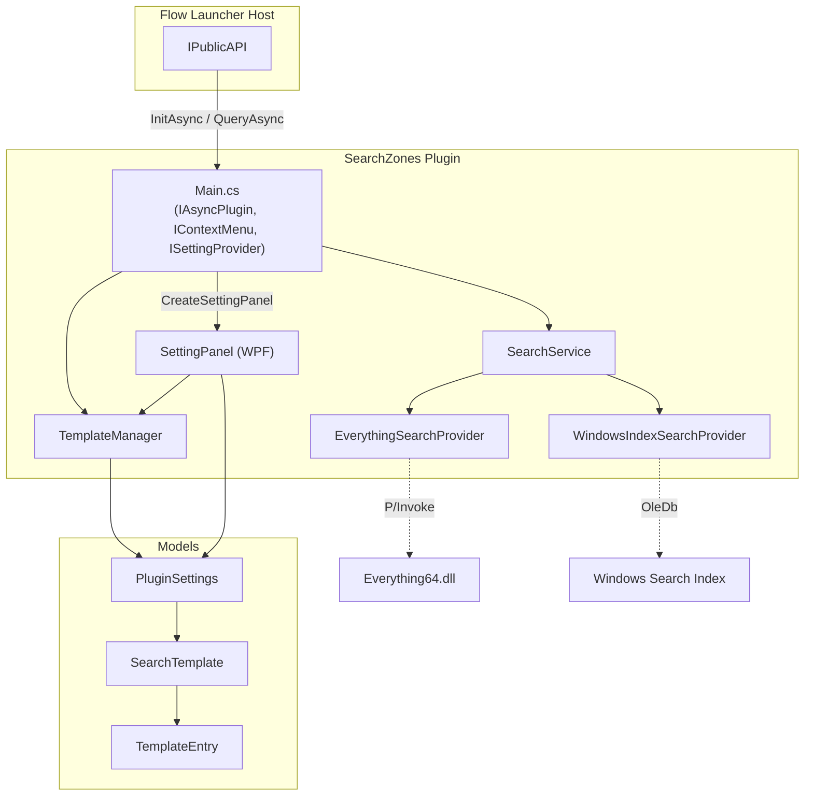
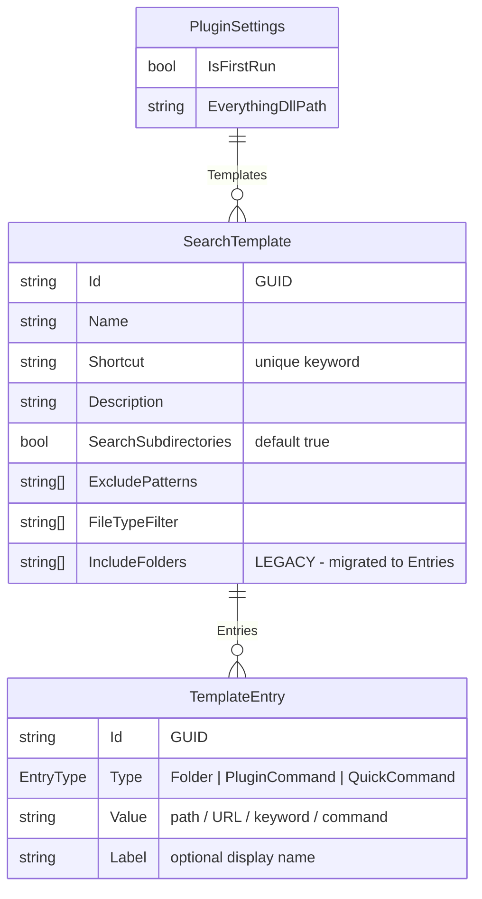
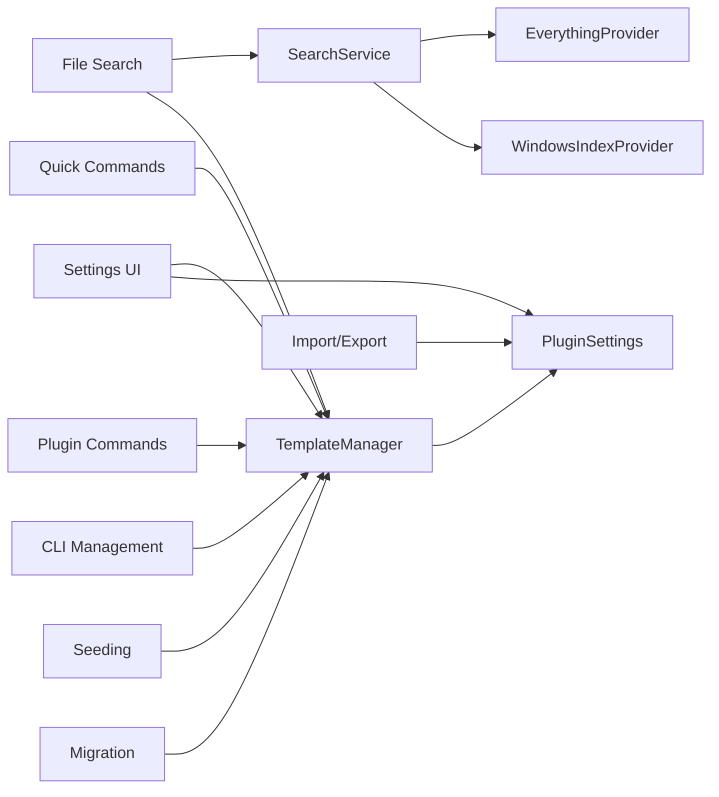

# SearchZones — Codebase Knowledge Document

> **Generated**: 2026-03-22  
> **Plugin Version**: 1.0.0  
> **Target Framework**: .NET 9.0 (Windows)

---

## Table of Contents

1. [High-Level Overview](#1-high-level-overview)
2. [Architecture](#2-architecture)
3. [Directory & File Map](#3-directory--file-map)
4. [Data Model](#4-data-model)
5. [Feature Catalog](#5-feature-catalog)
6. [Cross-Feature Interactions](#6-cross-feature-interactions)
7. [Services Deep Dive](#7-services-deep-dive)
8. [UI Layer](#8-ui-layer)
9. [Build & Deploy](#9-build--deploy)
10. [Things You Must Know Before Changing Code](#10-things-you-must-know-before-changing-code)
11. [Technical Reference & Glossary](#11-technical-reference--glossary)

---

## 1. High-Level Overview

### What It Is

**SearchZones** is a plugin for [Flow Launcher](https://github.com/Flow-Launcher/Flow.Launcher) (a Windows keystroke launcher, similar to Alfred/Raycast). It lets users create **search spaces** — reusable bundles that combine:

- **Folder searches** (file/directory lookup inside scoped directories)
- **Plugin commands** (launch another FL plugin keyword, or open a program)
- **Quick commands** (open URLs, run shell commands)

All are accessible under a single shortcut keyword via the `sz` action keyword.

### Business Purpose

Users who work across many projects, topics, or contexts can define a "search zone" per context (e.g. `uni` for university, `proj` for a project). Typing `sz uni react` instantly searches for "react" across all folders configured under the `uni` zone, while `sz uni` (without search term) shows quick links and commands.

### Tech Stack

| Layer | Technology |
|---|---|
| Language | C# 12 |
| Framework | .NET 9.0 (Windows) |
| UI | WPF (`UserControl` settings panel) |
| Plugin SDK | `Flow.Launcher.Plugin` 4.4.0 NuGet |
| File search (primary) | [Everything SDK](https://www.voidtools.com/support/everything/sdk/) via P/Invoke to `Everything64.dll` |
| File search (fallback) | Windows Search Index via `System.Data.OleDb` |
| Serialization | `System.Text.Json` |
| CI | AppVeyor |

---

## 2. Architecture

### Component Diagram



### Architectural Patterns

| Pattern | Where |
|---|---|
| **Strategy** | `ISearchProvider` interface with `EverythingSearchProvider` and `WindowsIndexSearchProvider` implementations; `SearchService` picks at runtime |
| **Template/Preset** | `SearchTemplate` = reusable configuration bundle of entries |
| **Command pattern** | Each `Result.Action` is a lambda — CLI-style management commands (`add`, `del`, `edit`, `settings`) |
| **Settings binding** | Flow Launcher JSON-based settings storage (`LoadSettingJsonStorage<PluginSettings>`) + WPF two-way bindings for the Settings UI |
| **Migration** | `MigrateTemplates()` converts legacy `IncludeFolders` list to typed `Entries` on startup |

### Data Flow

```
User types "sz uni react"
  → Flow Launcher invokes QueryAsync(query)
  → Main checks ActionKeyword == "sz"
  → TemplateManager.GetTemplateByShortcut("uni") → returns SearchTemplate
  → HandleSearchQuery(template, "react", token)
    → template.GetExpandedFolders() → [expanded paths]
    → SearchService.SearchAsync("react", folders, excludes, filters, subdirs, token)
      → if Everything running: EverythingSearchProvider.SearchAsync(...)
        → P/Invoke Everything64.dll → returns SearchResult[]
      → else: WindowsIndexSearchProvider.SearchAsync(...)
        → OleDb SQL to Windows Search Index → returns SearchResult[]
    → Map SearchResult[] to List<Result> (Flow Launcher display items)
    → Also filter/show PluginCommand and QuickCommand entries matching search term
  → Results displayed to user
```

---

## 3. Directory & File Map

```
Flow.Launcher.Plugin.SearchZones/
├── Main.cs                          # Plugin entry point (IAsyncPlugin, IContextMenu, ISettingProvider)
├── GlobalUsings.cs                  # global using System.IO
├── plugin.json                      # FL plugin manifest (ID, keyword "sz", version)
├── Flow.Launcher.Plugin.SearchZones.csproj  # Project file (net9.0-windows, WPF, NuGet refs)
├── Images/
│   └── icon.png                     # Plugin icon
├── Models/
│   ├── PluginSettings.cs            # Root settings: Templates list, IsFirstRun, EverythingDllPath
│   ├── SearchTemplate.cs            # A "search zone": name, shortcut, entries, filters
│   └── TemplateEntry.cs             # Single entry: Folder | PluginCommand | QuickCommand
├── Services/
│   ├── ISearchProvider.cs           # Interface + SearchResult record
│   ├── SearchService.cs             # Facade: picks Everything or Windows Index at query time
│   ├── EverythingSearchProvider.cs  # P/Invoke wrapper for Everything SDK
│   └── WindowsIndexSearchProvider.cs # OleDb queries against Windows Search
│   └── TemplateManager.cs           # CRUD for templates, migrations, seeding defaults
└── UI/
    ├── SettingPanel.xaml             # WPF settings UI (expanders per template, import/export)
    └── SettingPanel.xaml.cs          # Code-behind: entry management, folder browser, JSON import/export
```

### Root-Level Files

| File | Purpose |
|---|---|
| `appveyor.yml` | CI: publishes Release build, creates `.zip` artifact |
| `debug.ps1` | Dev script: publish Debug → deploy to FL Plugins folder → restart FL |
| `release.ps1` | Creates release `.zip` from Release publish output |
| `FlowLauncherPlugins.sln` | Solution file |

---

## 4. Data Model

### Entity Relationship



### EntryType Enum

| Value | Semantics | `Value` field contains |
|---|---|---|
| `Folder` | Directory to search for files | Filesystem path, may contain `%ENV_VARS%` |
| `PluginCommand` | FL action keyword or program executable | Single word = FL keyword; contains `\` or `/` = program path |
| `QuickCommand` | URL or shell command | Starts with `http(s)://` = URL; otherwise = shell command via `cmd.exe /c` |

### Computed Properties on `TemplateEntry`

| Property | Logic |
|---|---|
| `DisplayLabel` | `Label` if non-empty, else `Value` |
| `IsUrl` | Type is QuickCommand AND Value contains `://` |
| `IsFlKeyword` | Type is PluginCommand AND Value is one word without path separators |

### Computed Properties on `SearchTemplate`

| Property | Logic |
|---|---|
| `FolderEntries` | `Entries.Where(Type == Folder)` |
| `PluginCommandEntries` | `Entries.Where(Type == PluginCommand)` |
| `QuickCommandEntries` | `Entries.Where(Type == QuickCommand)` |
| `EntriesSummary` | e.g. "2 folders, 1 command, 3 quick" |
| `GetExpandedFolders()` | Expands `%ENV%` vars, filters to existing dirs |

### Persistence

Settings are stored as JSON by Flow Launcher (`context.API.LoadSettingJsonStorage<PluginSettings>()`). The file lives in FL's per-plugin settings directory. All mutations call `context.API.SavePluginSettings()`.

---

## 5. Feature Catalog

### F1: Search-Space File Search

**Business need**: Find files quickly across multiple project/topic-specific directories without searching the entire filesystem.

**Entry point**: `sz <shortcut> <search term>` → `Main.QueryAsync()` → `HandleSearchQuery()`

**Flow**:
1. `TemplateManager.GetTemplateByShortcut()` resolves shortcut to `SearchTemplate`
2. `SearchTemplate.GetExpandedFolders()` collects and validates folder paths
3. `SearchService.SearchAsync()` delegates to the available provider
4. Results mapped to `Result` objects: title = filename, subtitle = full path, icon = file itself
5. Context menu provides: open, open parent folder, copy path, copy filename

**Search providers** (see [Services Deep Dive](#7-services-deep-dive)):
- **Everything** — native P/Invoke, folder-scoped, max 200 results
- **Windows Index** — OleDb SQL, uses `SCOPE` / `DIRECTORY` filtering, max 200 results

### F2: Quick Commands

**Business need**: Launch frequently used URLs or shell commands from within a search zone without leaving the launcher.

**Entry point**: Shown when `sz <shortcut>` is typed without search term (preview mode), or filtered when a search term is typed.

**Behavior**:
- URLs → `Process.Start` with `UseShellExecute = true` (opens default browser)
- Shell commands → `cmd.exe /c <command>` via `Process.Start`

**Score**: 600 (highest among entry types)

### F3: Plugin Commands

**Business need**: Group related Flow Launcher plugins, program launchers, and tools together in a context-specific bundle.

**Entry point**: Same as Quick Commands — shown in preview or filtered by search term.

**Behavior**:
- FL keywords → `context.API.ChangeQuery("<keyword> ")` — switches FL to that plugin
- Program paths → `Process.Start` with `UseShellExecute = true`

**Score**: 300 (below Quick Commands)

### F4: Template Management (CLI)

**Business need**: Create, edit, and delete search zones directly from the Flow Launcher query bar.

**Commands** (all via `sz <command>`):

| Command | Action |
|---|---|
| `sz` | Lists all templates with metadata |
| `sz add <shortcut> <name> <folders>` | Creates new template (folders semicolon-separated) |
| `sz del <name-or-shortcut>` | Deletes matching template(s) |
| `sz edit <shortcut>` | Shows editable fields for a template |
| `sz edit <shortcut> <field> <value>` | Inline edit (name, shortcut, folders, exclude, types) |
| `sz settings everything <path>` | Configure Everything DLL path |

### F5: Settings UI (WPF Panel)

**Business need**: Visual management of search zones for users who prefer a GUI over CLI commands.

**Entry point**: Flow Launcher Settings → Plugins → SearchZones → `Main.CreateSettingPanel()`

**Capabilities**:
- Expander-based list of all templates
- Per-template: edit shortcut, name, description, subdirectory toggle
- Per-entry-type sections: add/remove Folders, Plugin Commands, Quick Commands
- Plugin Command ComboBox with filterable dropdown (FL keywords + installed Start Menu programs)
- Everything DLL path configuration with status indicator
- JSON Import/Export (merge or replace)

### F6: Import / Export

**Business need**: Backup, share, or migrate search zones between machines.

**Format**: JSON array of `SearchTemplate` objects (see README examples).

**Import modes**:
- **Merge** (Yes) — appends imported templates alongside existing
- **Replace** (No) — clears all existing, replaces with imported
- IDs are regenerated on import to prevent collisions

### F7: Default Seeding

**Business need**: Provide useful out-of-the-box templates on first run so the plugin isn't empty.

**Entry point**: `TemplateManager.SeedDefaults()` — runs only when `IsFirstRun == true`

**Default templates**: `ds` (Default Search — Downloads, Desktop, Documents, Pictures, Music, Videos), `dl` (Downloads), `doc` (Documents), `pic` (Pictures), `desk` (Desktop)

### F8: Legacy Migration

**Business need**: Seamlessly upgrade users from the old `IncludeFolders` string list to the new typed `Entries` model.

**Entry point**: `TemplateManager.MigrateTemplates()` — called before `SeedDefaults()` on every startup. Converts `IncludeFolders` → `TemplateEntry(Type=Folder)` then clears the legacy list.

---

## 6. Cross-Feature Interactions



**Key interactions**:
- All features read/write through `TemplateManager` and `PluginSettings` — no feature has its own separate state.
- `SearchService` is recreated whenever settings change (new `SearchService(_settings)`) to pick up a potentially new `EverythingDllPath`.
- The Settings UI directly mutates `PluginSettings.Templates` via two-way WPF bindings and calls `_onSave()` which triggers `SavePluginSettings()` + `SearchService` recreation.
- CLI commands (`HandleAddCommand`, `HandleEditCommand`, `HandleDeleteCommand`) go through `TemplateManager` methods which validate and persist.

---

## 7. Services Deep Dive

### SearchService (`Services/SearchService.cs`)

Thin facade. Holds one `EverythingSearchProvider` and one `WindowsIndexSearchProvider`. On each `SearchAsync` call, checks `_everything.IsServiceRunning` and delegates to that provider if true, otherwise falls back to `_windowsIndex`.

### EverythingSearchProvider (`Services/EverythingSearchProvider.cs`)

**DLL Loading Strategy** (lazy, in priority order):
1. User-configured `EverythingDllPath` setting
2. `%ProgramFiles%\Everything\Everything64.dll`
3. `%ProgramFiles(x86)%\Everything\Everything64.dll`
4. Windows Registry uninstall keys (`HKLM\SOFTWARE\...\Uninstall\Everything` → `InstallLocation`)
5. Running `Everything` / `Everything64` process → `MainModule.FileName` directory

Uses `SetDllDirectory()` to add the directory to the DLL search path so P/Invoke can resolve `Everything64.dll`.

**P/Invoke functions**: `Everything_SetSearchW`, `Everything_SetRequestFlags`, `Everything_SetMax`, `Everything_QueryW`, `Everything_GetLastError`, `Everything_GetNumResults`, `Everything_GetResultFullPathNameW`, `Everything_GetMajorVersion`

**Query building**: Folder scoping via `"<path>"` or `<"path1"|"path2">`, optional `ext:` filter, then the search term.

**Result limit**: 200 results max.

### WindowsIndexSearchProvider (`Services/WindowsIndexSearchProvider.cs`)

**Connection**: `OleDb` → `Provider=Search.CollatorDSO;Extended Properties='Application=Windows'`

**Query building**: SQL-like syntax against `SystemIndex` table.
- Folder scoping: `SCOPE = 'file:<path>'` (with subdirs) or `DIRECTORY = 'file:<path>'` (without)
- Search: `System.FileName LIKE '%<term>%'`
- File types: `System.FileName LIKE '%<ext>'`

**SQL injection protection**: `EscapeSql()` replaces `'` with `''`.

**Result limit**: 200 results max.

### TemplateManager (`Services/TemplateManager.cs`)

CRUD for `SearchTemplate` objects within `PluginSettings.Templates`:
- `AddTemplate` — validates non-empty shortcut/name, uniqueness
- `EditTemplate` — accepts `Action<SearchTemplate>` update delegate, validates shortcut uniqueness if changed
- `DeleteTemplate` — removes by ID
- `RegisterAllKeywords` — cleanup: removes any template shortcuts previously registered as FL action keywords (migration from earlier plugin version)
- `MigrateTemplates` — converts legacy `IncludeFolders` → `Entries`
- `SeedDefaults` — populates 5 default templates on first run

---

## 8. UI Layer

### SettingPanel (`UI/SettingPanel.xaml` + `.xaml.cs`)

WPF `UserControl` with vertical `StackPanel` layout:

1. **Everything section**: TextBox for DLL path + Browse button + status text (color-coded: green/orange/red)
2. **Templates section**: `ItemsControl` with `DataTemplate` rendering each template as an `Expander`
   - Header: shortcut (bold) | name | entries summary (gray)
   - Body: inline text editing for shortcut/name/description, checkbox for subdirectories
   - Three grouped sections (Folders, Plugin Commands, Quick Commands) each with entry list + add row
3. **Import/Export buttons**: bottom-right aligned

**Notable UI patterns**:
- `ObservableCollection<SearchTemplate>` powers the `ItemsControl`
- `RefreshList()` rebuilds the collection and restores expanded state via dispatcher
- Plugin Command ComboBox uses `ICollectionView` with dynamic text filter for search-as-you-type
- `BuildPluginCommandItems()` in Main.cs gathers all FL keywords + Start Menu `.lnk` files
- Scroll-fix: `PreviewMouseWheel` handler bubbles scroll events to FL's host `ScrollViewer` unless a ComboBox dropdown is open

---

## 9. Build & Deploy

### Local Development

```powershell
# Debug build + deploy to FL plugins folder + restart Flow Launcher
.\debug.ps1
```

Steps: `dotnet publish -c Debug -r win-x64 --no-self-contained` → copies to `%APPDATA%\FlowLauncher\Plugins\SearchZones` → starts FL.

### Release

```powershell
.\release.ps1
```

Runs `dotnet publish -c Release -r win-x64 --no-self-contained` → creates `SearchZones.zip`.

### CI (AppVeyor)

Defined in `appveyor.yml`:
- Image: Visual Studio 2022
- Build: `dotnet publish -c Release -r win-x64 --no-self-contained`
- Artifact: `Flow.Launcher.Plugin.SearchZones.zip`

---

## 10. Things You Must Know Before Changing Code

### Critical Design Decisions

1. **Single action keyword**: All functionality runs under `sz`. Individual template shortcuts are **not** registered as FL action keywords. `RegisterAllKeywords()` actively **removes** template shortcuts from FL's keyword registry to clean up after an earlier design.

2. **Provider selection is per-query**: `SearchService.SearchAsync()` checks `IsServiceRunning` every call. A user can start/stop Everything mid-session and the plugin adapts. `SearchService` itself is recreated when settings change.

3. **Everything DLL is loaded lazily**: `EnsureDllLoaded()` tries multiple candidates on first use. The DLL path is resolved once and cached via `_dllLoaded` flag. Changing the DLL path setting requires a new `SearchService` instance (which happens via settings save).

4. **`IsServiceRunning` vs `IsAvailable`**: 
   - `IsAvailable` = Everything process is running (for status display only)
   - `IsServiceRunning` = DLL loaded AND `Everything_GetMajorVersion() > 0` (for actual search delegation)

5. **All UI text is in German**: Status messages, button labels, and management command outputs use German strings (e.g. "Suchraum", "Ordner", "Einstellungen").

### Potential Gotchas

- **`Everything_SetSearchW` is process-global**: The Everything SDK uses static global state. If another plugin also uses Everything SDK in the same process, calls could interfere. Not currently an issue in practice.

- **WPF DataTemplate named elements**: `FindNamedChild<T>()` walks the visual tree to find named controls inside `DataTemplate` (e.g. `NewFolderValueBox`). WPF doesn't support `x:Name` lookup across `DataTemplate` boundaries, hence the helper.

- **Import without validation**: JSON import deserializes directly into `SearchTemplate` list. Imported templates are not validated for shortcut uniqueness against existing templates or each other — could result in duplicate shortcuts.

- **SQL injection in Windows Index provider**: `EscapeSql()` only escapes single quotes. The provider builds SQL strings via concatenation. While this queries only the local Windows Search Index (not a network database), unusual filenames or search terms with SQL metacharacters could theoretically cause query failures.

- **max 200 results**: Both providers cap at 200. This is hardcoded, not configurable.

- **`cmd.exe /c` for shell commands**: Quick Commands that aren't URLs are executed via `cmd.exe /c <command>`. The command string comes from user-configured settings (not external input), so this is acceptable, but be aware of command injection risk if this ever accepts untrusted input.

- **Process enumeration for Everything detection**: `GetProcessesByName` is called on status checks. This is fine for occasional use but would be expensive if called frequently.

- **Registry access for DLL location**: Uses `HKLM` lookup. May fail without elevation on locked-down systems, but the code catches exceptions.

### Performance Considerations

- Everything SDK search is synchronous (blocks the calling thread) despite the `Task<>` return type. The actual P/Invoke calls happen on the thread pool but aren't truly async.
- Windows Index provider uses `OleDbConnection.OpenAsync` / `ExecuteReaderAsync` — genuinely async.
- `BuildPluginCommandItems()` enumerates Start Menu `.lnk` files on every `CreateSettingPanel()` call. Could be slow with many shortcuts but only runs when settings UI is opened.

---

## 11. Technical Reference & Glossary

### Glossary

| Term | Meaning |
|---|---|
| **Search Zone / Search Space / Suchraum** | A `SearchTemplate` — a named, shortcut-activated bundle of folder searches, commands, and links |
| **Template** | Same as Search Zone (internal code name) |
| **Entry** | A `TemplateEntry` — one item inside a search zone (folder, command, or link) |
| **Shortcut** | The keyword typed after `sz` to activate a search zone (e.g. `uni`, `dl`, `proj`) |
| **Action Keyword** | Flow Launcher concept — the first word that routes a query to a plugin. For SearchZones this is always `sz` |
| **Everything** | [voidtools Everything](https://www.voidtools.com/) — a Windows file search utility with an SDK |
| **FL** | Flow Launcher |
| **Quick Command** | An entry that opens a URL or runs a shell command |
| **Plugin Command** | An entry that switches to another FL plugin or launches a program |

### Key Classes & Functions

| Class / Function | File | Purpose |
|---|---|---|
| `SearchZones` | `Main.cs` | Plugin entry point; implements `IAsyncPlugin`, `IContextMenu`, `ISettingProvider` |
| `SearchZones.InitAsync()` | `Main.cs#L18` | Loads settings, creates services, runs migrations and seeding |
| `SearchZones.QueryAsync()` | `Main.cs#L32` | Routes queries to search handling or management commands |
| `HandleSearchQuery()` | `Main.cs#L48` | Executes folder search + shows commands/links |
| `HandleManagementQuery()` | `Main.cs#L257` | Dispatches `add`/`del`/`edit`/`settings` commands |
| `BuildPluginCommandItems()` | `Main.cs#L853` | Gathers FL keywords + Start Menu programs for Settings UI dropdown |
| `PluginSettings` | `Models/PluginSettings.cs` | Root settings container |
| `SearchTemplate` | `Models/SearchTemplate.cs` | Search zone definition with entries and filters |
| `TemplateEntry` | `Models/TemplateEntry.cs` | Single entry + `EntryType` enum |
| `ISearchProvider` | `Services/ISearchProvider.cs` | Search provider interface + `SearchResult` record |
| `SearchService` | `Services/SearchService.cs` | Provider selector facade |
| `EverythingSearchProvider` | `Services/EverythingSearchProvider.cs` | Everything SDK P/Invoke wrapper |
| `WindowsIndexSearchProvider` | `Services/WindowsIndexSearchProvider.cs` | Windows Search OleDb provider |
| `TemplateManager` | `Services/TemplateManager.cs` | CRUD, migration, seeding for templates |
| `SettingPanel` | `UI/SettingPanel.xaml(.cs)` | WPF settings UI with expanders, entry management, import/export |

### NuGet Dependencies

| Package | Version | Purpose |
|---|---|---|
| `Flow.Launcher.Plugin` | 4.4.0 | FL plugin SDK (interfaces, API) |
| `System.Data.OleDb` | 9.0.0 | Windows Search Index access |

### Plugin Manifest (`plugin.json`)

| Field | Value |
|---|---|
| ID | `6F84CC74D30945B280A6F567228A5F89` |
| ActionKeyword | `sz` |
| Name | `SearchZones` |
| Language | `csharp` |
| ExecuteFileName | `Flow.Launcher.Plugin.SearchZones.dll` |

---

## Assumptions & Open Questions

| # | Assumption | Confidence |
|---|---|---|
| A1 | Only one instance of the plugin runs per FL process | High |
| A2 | `SavePluginSettings()` writes synchronously and is safe to call from any thread | Medium |
| A3 | Everything SDK global state won't conflict with other plugins | Medium |
| A4 | Start Menu `.lnk` enumeration is fast enough for settings UI | Medium |

| # | Open Question |
|---|---|
| Q1 | Should import validate shortcut uniqueness against existing templates? |
| Q2 | Should the 200-result limit be user-configurable? |
| Q3 | Is localization (German → English / i18n) planned? |
