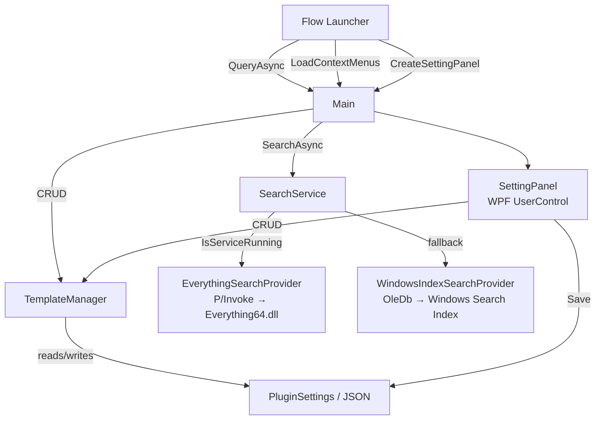
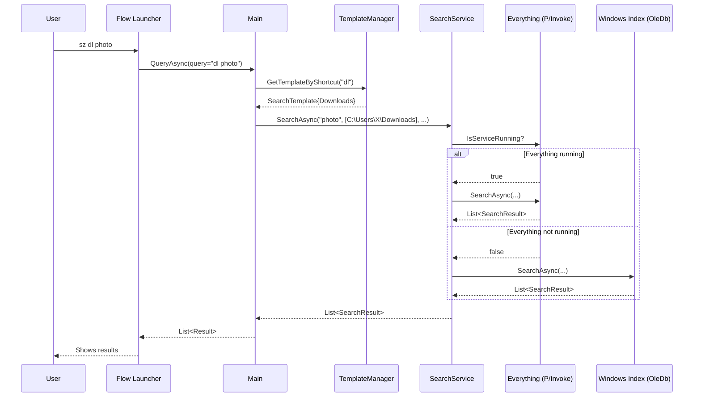

# CODEBASE KNOWLEDGE — Flow.Launcher.Plugin.SearchZones

> Auto-generated master knowledge document.  
> Every claim is tied to an actual file, class, or function in this repository.

---

## Table of Contents

1. [High-Level Overview](#1-high-level-overview)
2. [Repository Structure & File Index](#2-repository-structure--file-index)
3. [System Architecture](#3-system-architecture)
4. [Feature-by-Feature Analysis](#4-feature-by-feature-analysis)
5. [Data Flow](#5-data-flow)
6. [Things You Must Know Before Changing Code](#6-things-you-must-know-before-changing-code)
7. [Technical Reference & Glossary](#7-technical-reference--glossary)
8. [Assumptions & Open Questions](#8-assumptions--open-questions)

---

## 1. High-Level Overview

### What the Application Is

**Flow.Launcher.Plugin.SearchZones** is a plugin for [Flow Launcher](https://www.flowlauncher.com/), a Windows application launcher. The plugin lets users define named **search templates** — each template is a labelled collection of folder paths and optional filters that can be searched by typing a short keyword (a "shortcut") in Flow Launcher.

**Business purpose in one sentence**: Speed up file discovery on Windows by giving the user named, scoped folder searches that are invoked with a memorable two-letter keyword instead of remembering full paths or opening Explorer.

### Target Users

Power users of Flow Launcher who regularly search inside specific folder sets (project directories, a downloads folder, a pictures archive, etc.) and want the search scoped to that set rather than the entire drive.

### Main Features

| Feature | Shortcut / Entry Point | Purpose |
|---|---|---|
| Template management (list / add / edit / delete) | `sz` (then subcommand) | CRUD on search templates via Flow Launcher query bar |
| Scoped file search | `sz <shortcut> <query>` | Search files/folders inside a template's configured paths |
| Everything SDK integration | Automatic (if running) | Fast full-drive search, restricted to configured folders |
| Windows Search Index fallback | Automatic | Built-in search if Everything is not running |
| Settings/config UI panel | Flow Launcher settings tab | Visual CRUD for templates + manual Everything DLL path |
| Context menu on results | Right-click a result | Open file/folder, reveal in Explorer, copy path |

### Feature Interactions at a Glance

```
User types "sz dl photo"
      │
      ▼
Main.cs:QueryAsync()
   ├─ resolves "dl" → SearchTemplate (Downloads)
   ├─ delegates to SearchService
   │       └─ selects EverythingSearchProvider   (if Everything.exe is running)
   │           OR WindowsIndexSearchProvider      (fallback)
   └─ returns Result list → Flow Launcher renders results
         └─ right-click → LoadContextMenus() → open / copy / reveal actions
```

---

## 2. Repository Structure & File Index

```
flow-launcher-plug/
├── FlowLauncherPlugins.sln                  Solution file (single project)
├── appveyor.yml                              CI build (AppVeyor)
├── debug.ps1                                Dev helper: build & deploy to local FL plugin dir
├── release.ps1                              Release helper: build & zip for distribution
├── Readme.md                                User-facing documentation
└── Flow.Launcher.Plugin.SearchZones/
    ├── Flow.Launcher.Plugin.SearchZones.csproj   Project file (net9.0-windows)
    ├── GlobalUsings.cs                      global using System.IO;
    ├── Main.cs                              ★ Plugin entry point – all FL callbacks
    ├── plugin.json                          Plugin metadata (ID, ActionKeyword, version)
    ├── Images/                              icon.png + other assets
    ├── Models/
    │   ├── PluginSettings.cs                Settings root (serialised by FL)
    │   └── SearchTemplate.cs               Template data model
    ├── Services/
    │   ├── ISearchProvider.cs              Interface + SearchResult record
    │   ├── SearchService.cs                Provider selector (Everything vs Windows Index)
    │   ├── EverythingSearchProvider.cs     Everything SDK via P/Invoke
    │   ├── WindowsIndexSearchProvider.cs   Windows Search Index via OleDb / WDS SQL
    │   └── TemplateManager.cs              Template CRUD, keyword registration, seed data
    └── UI/
        ├── SettingPanel.xaml               WPF settings panel layout
        └── SettingPanel.xaml.cs            Code-behind for settings panel
```

### Priority File Index

| # | Priority | Path | Role |
|---|---|---|---|
| 1 | ★★★ | `Main.cs` | Entry point; all Flow Launcher callbacks |
| 2 | ★★★ | `Services/SearchService.cs` | Backend selector |
| 3 | ★★★ | `Services/EverythingSearchProvider.cs` | Primary search (P/Invoke) |
| 4 | ★★★ | `Services/WindowsIndexSearchProvider.cs` | Fallback search (OleDb) |
| 5 | ★★★ | `Services/TemplateManager.cs` | Template CRUD + FL keyword registration |
| 6 | ★★ | `Models/SearchTemplate.cs` | Core data model |
| 7 | ★★ | `Models/PluginSettings.cs` | Settings root |
| 8 | ★★ | `UI/SettingPanel.xaml.cs` | Settings UI code-behind |
| 9 | ★ | `UI/SettingPanel.xaml` | Settings UI layout |
| 10 | ★ | `plugin.json` | Plugin manifest |

---

## 3. System Architecture

### Interfaces Implemented by `Main.cs`

| Interface | Purpose |
|---|---|
| `IAsyncPlugin` | `InitAsync()` and `QueryAsync()` — main entry points |
| `IContextMenu` | `LoadContextMenus()` — right-click menu on results |
| `IPluginI18n` | `GetTranslatedPluginTitle/Description()` — plugin name display |
| `ISettingProvider` | `CreateSettingPanel()` — returns the WPF settings control |

### Component Diagram



### Key Cross-Cutting Concerns

| Concern | Implementation |
|---|---|
| **Persistence** | `IPublicAPI.LoadSettingJsonStorage<PluginSettings>()` / `SavePluginSettings()` — FL manages the JSON file |
| **Thread safety** | `QueryAsync` is async; `CancellationToken` passed through to both search providers. Everything P/Invoke calls are synchronous (wrapped in `Task.FromResult`). |
| **Environment variable expansion** | `SearchTemplate.GetExpandedFolders()` calls `Environment.ExpandEnvironmentVariables()` on each folder path before use |
| **Security** | No user-provided strings are ever passed to shell or `cmd.exe`; `Process.Start` uses `ProcessStartInfo` with `UseShellExecute = true`. SQL parameters in `WindowsIndexSearchProvider` are escaped via `EscapeSql()`. |
| **Localisation** | UI strings are in German (app is written by a German-speaking author). The FL plugin title/description are in English. |

---

## 4. Feature-by-Feature Analysis

### 4.1 Plugin Initialization

**File**: `Main.cs` → `InitAsync()`

**What happens on startup**:
1. `PluginSettings` is deserialised from FL's JSON storage.
2. `SearchService` is constructed (which creates `EverythingSearchProvider` and `WindowsIndexSearchProvider`).
3. `TemplateManager` is constructed and:
   - `SeedDefaults()` — on first run only (`IsFirstRun == true`), creates 5 default templates (Default Search, Downloads, Documents, Pictures, Desktop) and marks `IsFirstRun = false`.
   - `RegisterAllKeywords()` — removes any leftover action keywords that templates may have registered in a prior plugin version. The plugin now uses only `sz` as its single action keyword; template shortcuts are parsed from the query string, not registered as separate FL action keywords.

**Business purpose**: Guarantee the plugin is usable out of the box without any manual configuration.

---

### 4.2 Template Management via `sz`

**Entry point**: `Main.cs` → `QueryAsync()` → `HandleManagementQuery()`

**Trigger**: User types `sz` (the management keyword, constant `ManagementKeyword = "sz"`). The query does **not** match any registered template shortcut.

**Sub-commands**:

| User types | Handler | Effect |
|---|---|---|
| `sz` (nothing) | `ShowAllTemplates()` | Lists all templates + "Create new" entry |
| `sz <partial>` | `ShowAllTemplates(filter)` | Filters templates by name/shortcut |
| `sz add <shortcut> <name> <f1;f2>` | `HandleAddCommand()` | Preview → confirm adds template |
| `sz del <nameOrShortcut>` | `HandleDeleteCommand()` | Preview → confirm deletes template |
| `sz edit <shortcut>` | `HandleEditCommand()` | Shows editable fields |
| `sz edit <shortcut> name <v>` | `HandleEditCommand()` | Inline field edit |
| `sz settings everything <path>` | `HandleSettingsCommand()` | Set Everything DLL path |

**Scoring logic** (`TemplateScore()`):
- Exact shortcut match → 1000
- Shortcut prefix match → 900
- Name starts with filter → 700
- Name contains filter → 600
- Default → 500

**Business purpose**: Allow users to manage their search configuration entirely from the Flow Launcher command bar without opening a GUI.

---

### 4.3 Scoped File Search

**Entry point**: `Main.cs` → `QueryAsync()` → `HandleSearchQuery()`

**Trigger**: User types `sz <shortcut> <query>` where `<shortcut>` matches a registered `SearchTemplate.Shortcut`.

**Flow**:
1. The first word after `sz` is looked up via `TemplateManager.GetTemplateByShortcut()`.
2. If matched and `<query>` is empty → show a "prompt" result telling the user what to type.
3. If `<query>` is non-empty:
   a. `SearchTemplate.GetExpandedFolders()` expands env vars and filters out non-existent directories.
   b. `SearchService.SearchAsync()` is called with the query, folders, exclude patterns, file type filter, and subdirectory flag.
   c. Results are mapped to FL `Result` objects. Each result:
      - Title = filename, SubTitle = full path
      - `IcoPath` = full file path (FL resolves system file icons from path)
      - `ContextData` = full path (used by context menu)
      - `Action` = opens file with `UseShellExecute` or opens folder in Explorer

**Business purpose**: Give the user a fast, folder-scoped file search accessible from the same launcher they use for everything else.

---

### 4.4 Everything Search Backend

**File**: `Services/EverythingSearchProvider.cs`

**What it does**: Uses P/Invoke to call `Everything64.dll` — the native DLL shipped with [voidtools Everything](https://www.voidtools.com/) — to perform instant indexed searches.

**DLL discovery order** (`EnsureDllLoaded()`):
1. User-configured path (`PluginSettings.EverythingDllPath`)
2. `%ProgramFiles%\Everything\Everything64.dll`
3. `%ProgramFiles(x86)%\Everything\Everything64.dll`
4. Registry: `HKLM\SOFTWARE\...\Uninstall\Everything` → `InstallLocation`
5. Running `Everything.exe` / `Everything64.exe` process → executable directory

**Availability check** (`IsAvailable`): Simply checks if the Everything process is running (no DLL load required). Used by `Main.cs` for the status indicator result.

**Service check** (`IsServiceRunning`): Loads the DLL and calls `Everything_GetMajorVersion()`. Used by `SearchService` to decide which provider to actually use.

**Query construction** (`BuildQuery()`):
- Single folder: `"<folder>" <query>`
- Multiple folders: `<"f1"|"f2"> <query>`
- File type filter: `ext:<ext1;ext2>` clause prepended
- Returns up to 200 results (`Everything_SetMax(200)`)

**Exclude filtering**: Post-processed client-side — `IsExcluded()` checks `Contains()` on the full path.

**P/Invoke declarations**: `SetDllDirectory`, `Everything_SetSearchW`, `Everything_SetRequestFlags`, `Everything_SetMax`, `Everything_QueryW`, `Everything_GetLastError`, `Everything_GetNumResults`, `Everything_GetResultFullPathNameW`, `Everything_GetMajorVersion`.

**Business purpose**: Millisecond-speed search across large drives, giving a far better UX than Windows Search.

---

### 4.5 Windows Search Index Fallback

**File**: `Services/WindowsIndexSearchProvider.cs`

**What it does**: Uses `System.Data.OleDb` to query the Windows Search database (`SystemIndex`) via a SQL-like dialect called WDS (Windows Desktop Search) SQL.

**Connection string**: `Provider=Search.CollatorDSO;Extended Properties='Application=Windows'`

**Query construction** (`BuildSql()`):
- Scope: `SCOPE = 'file:<folder>'` (deep) or `DIRECTORY = 'file:<folder>'` (shallow) per folder, joined with `OR`
- Search term: `System.FileName LIKE '%<query>%'`
- File type filter: `System.FileName LIKE '%<ext>'` per extension, joined with `OR`
- Returns up to 200 results (enforced in the `while` loop)

**SQL injection prevention**: `EscapeSql()` escapes single quotes by doubling them before interpolation. This is the query's only injection surface.

**Availability check**: Tries to open the OleDb connection; returns `false` on exception.

**Business purpose**: Zero-dependency fallback that works on any Windows machine without installing Everything.

---

### 4.6 Settings UI Panel

**Files**: `UI/SettingPanel.xaml` + `UI/SettingPanel.xaml.cs`

**Returned by**: `Main.cs` → `CreateSettingPanel()` → `new UI.SettingPanel(_settings, _templateManager, onSave)`

**Layout sections**:
1. **Everything Search** — text box for DLL path, "..." browse button, status text label
2. **Templates DataGrid** — read-only grid showing all templates (shortcut, name, folders, description, subdirs checkbox)
3. **Toolbar** — `+Add`, `Edit`, `Delete` buttons
4. **Edit Form** (collapsible `Border`) — shortcut, name, description, folder list with add/browse/remove, subdirs checkbox, Save/Cancel

**Mode switching**: `_editingId` field: `null` = add mode, non-null string = edit mode (holds the template `Id`).

**Folder browse hack**: WPF has no native folder picker prior to .NET 6 / Windows App SDK. The code uses `OpenFileDialog` with `ValidateNames=false` and `CheckFileExists=false`, then calls `Path.GetDirectoryName()` on the result to get the folder path.

**Save callback**: The `Action _onSave` delegate passed from `Main.cs` calls `_context.API.SavePluginSettings()` and re-creates `SearchService` (to reload the Everything DLL path).

**Business purpose**: Provide a discoverable GUI alternative to the command-bar management subcommands, especially useful for complex template edits (folder lists).

---

### 4.7 Context Menu

**File**: `Main.cs` → `LoadContextMenus()`

**Trigger**: User right-clicks a search result in Flow Launcher.

**Data source**: `Result.ContextData` stores the full file/folder path set during `HandleSearchQuery()`.

**Menu items**:
| Item | Action |
|---|---|
| "Datei/Ordner öffnen" | `Process.Start` with `UseShellExecute = true` |
| "Übergeordneten Ordner öffnen" | `explorer.exe /select,"<path>"` |
| "Pfad kopieren" | `IPublicAPI.CopyToClipboard(fullPath)` |
| "Dateiname kopieren" | `IPublicAPI.CopyToClipboard(Path.GetFileName(fullPath))` |

**Business purpose**: Reduce the need to open Explorer for common post-search actions.

---

## 5. Data Flow

### Query Flow (Search Mode)



### Settings Persistence Flow

```
PluginSettings (in-memory object, root of all state)
    │
    ├── Mutated by: TemplateManager.AddTemplate / EditTemplate / DeleteTemplate
    ├── Mutated by: SettingPanel (via TemplateManager + direct field writes for EverythingDllPath)
    │
    └── Serialised/Deserialised by: IPublicAPI.SavePluginSettings / LoadSettingJsonStorage<T>
            └── JSON file managed by Flow Launcher (location: FL's plugin data folder)
```

---

## 6. Things You Must Know Before Changing Code

### 6.1 Single Action Keyword Architecture

The plugin **intentionally uses only one action keyword: `sz`**. Template shortcuts are parsed from the query string in `QueryAsync()`, not registered as separate FL action keywords.

`TemplateManager.RegisterAllKeywords()` actively **removes** any template shortcut that was registered as an action keyword (legacy cleanup). If you re-introduce per-template keywords, this method will undo your work on every startup.

### 6.2 Everything DLL Is Not Bundled

`Everything64.dll` is not a NuGet package or a bundled file. The plugin auto-discovers it at runtime. If you change the discovery logic in `EnsureDllLoaded()`, test all five discovery paths.

### 6.3 `IsAvailable` vs `IsServiceRunning` Are Different

`EverythingSearchProvider.IsAvailable`: checks process existence (cheap, no DLL load). Used only for the **status indicator** shown in the management result list.

`EverythingSearchProvider.IsServiceRunning`: loads the DLL and calls an API function. The one used by `SearchService` to decide whether to actually search with Everything. These must not be conflated.

### 6.4 `SetDllDirectory` SideEffect

`EnsureDllLoaded()` calls `SetDllDirectory(Path.GetDirectoryName(path))` as a process-wide side effect to let Windows resolve `Everything64.dll` from its install directory. Changing the DLL path at runtime (via settings) requires re-creating `SearchService` — which is why `CreateSettingPanel()` passes an `onSave` callback that does exactly that.

### 6.5 Environment Variable Expansion Is Deferred

`SearchTemplate.IncludeFolders` stores raw paths, potentially with `%USERPROFILE%` etc. Expansion only happens in `GetExpandedFolders()`. **Never** call `IncludeFolders` directly when you need actual filesystem paths.

### 6.6 WPF Folder Picker Hack

`SettingPanel.xaml.cs → BrowseFolderButton_Click()` uses `OpenFileDialog` in folder-selection mode (a well-known WPF workaround). It strips the fake filename using `Path.GetDirectoryName()`. This requires the user to click "Open" without selecting a file — the path shown is the selected directory.

### 6.7 SQL Injection Surface in Windows Search Provider

`WindowsIndexSearchProvider.BuildSql()` interpolates user-typed search terms and folder paths into a WDS SQL string. Mitigation is the `EscapeSql()` helper (single-quote doubling). This is correct for WDS SQL but **not** a prepared-statement approach. When adding new interpolated fields, always pass them through `EscapeSql()`.

### 6.8 First-Run Seed Happens Once

`TemplateManager.SeedDefaults()` reads `PluginSettings.IsFirstRun` and sets it to `false` immediately. Default templates are added **exactly once** per plugin installation. Adding new defaults in a future version requires a migration strategy (e.g., a version field), because `SeedDefaults` will no-op for existing users.

### 6.9 Result Limit Is Hardcoded at 200

Both providers cap results at 200. `Everything_SetMax(200)` in `EverythingSearchProvider`; `results.Count < 200` guard in `WindowsIndexSearchProvider`. There is no user-configurable page size.

### 6.10 German UI Strings

All user-visible strings in `Main.cs` and `SettingPanel.xaml` are in **German**. Localisation is not implemented. If internationalisation is needed, these strings need to be extracted to resource files.

---

## 7. Technical Reference & Glossary

### Domain Glossary

| Term | Definition |
|---|---|
| **Template** | A named configuration object: a shortcut, a set of include folders, optional exclude patterns, optional file type filters, and a subdirectory flag |
| **Shortcut** | A short keyword (e.g., `dl`, `doc`) typed after `sz` to identify a template |
| **Management keyword** | `sz` — the single FL action keyword for the entire plugin |
| **Provider** | An implementation of `ISearchProvider` (`Everything` or `WindowsIndex`) |
| **Action keyword** | A FL concept: a keyword that routes a query to a specific plugin |
| **Seed / first run** | Automatic creation of default templates on the very first plugin load |
| **Everything** | [voidtools Everything](https://www.voidtools.com/) — a free Windows search tool with an SDK DLL |
| **Windows Search Index** | Windows' built-in file indexer, queryable via OleDb and WDS SQL |

### Key Classes and Functions

| Symbol | File | Summary |
|---|---|---|
| `SearchZones` | `Main.cs` | Plugin root class; all FL callbacks |
| `QueryAsync()` | `Main.cs` | Routes query to search or management handler |
| `HandleSearchQuery()` | `Main.cs` | Produces file search results for a matched template |
| `HandleManagementQuery()` | `Main.cs` | Dispatches `add`, `del`, `edit`, `settings` subcommands |
| `ShowAllTemplates()` | `Main.cs` | Lists templates with optional text filter + status indicators |
| `LoadContextMenus()` | `Main.cs` | Returns right-click actions for a search result |
| `CreateSettingPanel()` | `Main.cs` | Returns the WPF settings control |
| `SearchTemplate` | `Models/SearchTemplate.cs` | Data model; `GetExpandedFolders()` expands env vars |
| `PluginSettings` | `Models/PluginSettings.cs` | Root settings object serialised by FL |
| `TemplateManager` | `Services/TemplateManager.cs` | CRUD on `PluginSettings.Templates`; keyword registration; seed |
| `SearchService` | `Services/SearchService.cs` | Selects provider based on `IsServiceRunning`; delegates search |
| `EverythingSearchProvider` | `Services/EverythingSearchProvider.cs` | P/Invoke wrapper for Everything64.dll |
| `WindowsIndexSearchProvider` | `Services/WindowsIndexSearchProvider.cs` | OleDb / WDS SQL search against Windows Search Index |
| `ISearchProvider` | `Services/ISearchProvider.cs` | Interface: `IsAvailable` + `SearchAsync()` |
| `SearchResult` | `Services/ISearchProvider.cs` | Record: `FullPath`, `FileName`, `IsFolder` |
| `SettingPanel` | `UI/SettingPanel.xaml.cs` | WPF code-behind for the settings panel |
| `EnsureDllLoaded()` | `EverythingSearchProvider.cs` | Lazy-loads Everything64.dll; five discovery strategies |
| `BuildQuery()` | `EverythingSearchProvider.cs` | Constructs Everything search string with folder scoping |
| `BuildSql()` | `WindowsIndexSearchProvider.cs` | Constructs WDS SQL query with scope, term, type filter |
| `SeedDefaults()` | `TemplateManager.cs` | Creates 5 default templates on first run |
| `RegisterAllKeywords()` | `TemplateManager.cs` | Removes legacy per-template FL action keywords |

### Dependencies

| Dependency | Version | Role |
|---|---|---|
| `Flow.Launcher.Plugin` | 4.4.0 | FL plugin SDK (interfaces, `IPublicAPI`, `Result`, etc.) |
| `System.Data.OleDb` | 9.0.0 | Windows Search Index queries |
| `Everything64.dll` | runtime / external | voidtools Everything search engine SDK |
| .NET | 9.0-windows | Runtime |
| WPF | (included in .NET 9 windows) | Settings panel UI |

### `plugin.json` Manifest

```json
{
  "ID": "6F84CC74D30945B280A6F567228A5F89",
  "ActionKeyword": "sz",
  "Name": "SearchZones",
  "Version": "1.0.0",
  "Language": "csharp",
  "ExecuteFileName": "Flow.Launcher.Plugin.SearchZones.dll"
}
```

### Default Templates (Seeded on First Run)

| Shortcut | Name | Folders |
|---|---|---|
| `ds` | Default Search | Downloads, Desktop, Documents, Pictures, Music, Videos |
| `dl` | Downloads | `%USERPROFILE%\Downloads` |
| `doc` | Documents | `%USERPROFILE%\Documents` |
| `pic` | Pictures | `%USERPROFILE%\Pictures` |
| `desk` | Desktop | `%USERPROFILE%\Desktop` |

---

## 8. Assumptions & Open Questions

| # | Item | Confidence | Notes |
|---|---|---|---|
| A1 | `IPublicAPI.AddActionKeyword` / `RemoveActionKeyword` calls in `SeedDefaults` / `RegisterAllKeywords` are legacy and produce no visible effect to end users since shortcuts are no longer registered as FL keywords | High | Code comment confirms this is intentional cleanup |
| A2 | The `IcoPath = r.FullPath` in search results relies on Flow Launcher resolving the system icon from the file path | High | Standard FL plugin convention |
| A3 | `AllowUnsafeBlocks = true` in csproj is required for P/Invoke with `StringBuilder` buffers in Everything provider | High | No actual `unsafe` keyword is used; may be a leftover setting |
| A4 | `Results` from Everything are not re-sorted — FL's own result ranking may reorder them | Medium | No explicit sort in `HandleSearchQuery()` |
| O1 | What happens when Everything is installed but `Everything64.dll` cannot be found even after all 5 discovery attempts? | — | Plugin silently falls back to Windows Index; status result warns user |
| O2 | Are there plans to support per-template exclude or file-type filter editing via the settings panel? | — | The model supports it, but `SettingPanel.xaml` currently only exposes folders and `SearchSubdirectories` |
| O3 | The `ExcludePatterns` field is fully supported by both search providers but has no UI for editing it via the settings panel | — | Only editable via `sz edit <shortcut> exclude <patterns>` in the command bar |

---

*Document covers commit state as of March 2026. Re-run analysis after significant structural changes.*
